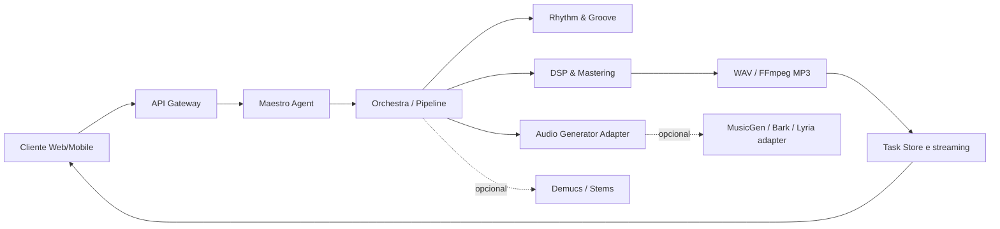

# Arquitetura do KAIR-S-SONICA

## Princípio de composição

O sistema é organizado como um **pipeline de portas e adaptadores**. O domínio musical conhece somente os contratos em `kairos_core`; detalhes de bibliotecas pesadas, binários externos ou serviços remotos ficam atrás de adaptadores substituíveis. Isso permite executar o projeto em CPU para desenvolvimento e mover os mesmos contratos para GPU, workers e armazenamento distribuído em uma etapa posterior.

## Componentes

| Componente | Entrada | Saída | Estado |
| --- | --- | --- | --- |
| `MaestroAgent` | `TrackRequest` | `TrackPlan` | Funcional e determinístico |
| `RhythmAgent` | BPM, swing, humanização | Grade temporal | Funcional |
| `ProceduralDemoGenerator` | Plano musical | Matriz PCM estéreo | Funcional, CPU |
| `AudioGenerator` | Plano musical | Matriz PCM | Contrato para modelos |
| `DSP` | PCM | PCM masterizado | Funcional, NumPy |
| `StemSeparator` | Arquivo de áudio | Mapa de stems | Contrato opcional |
| `Transcoder` | PCM/WAV | WAV/MP3 | WAV funcional; MP3 via FFmpeg |
| `TaskStore` | Estado de pipeline | Snapshot e eventos | Em memória no MVP |
| API | JSON/WebSocket | JSON/arquivo | Funcional |

## Fluxo de uma geração

1. O gateway valida `TrackRequest` e atribui um identificador de tarefa.
2. O `MaestroAgent` normaliza gênero, tonalidade, escala, BPM e seções.
3. O orquestrador cria a grade de groove, chama o gerador configurado e aplica masterização conservadora.
4. O transcodificador grava WAV e, quando solicitado e disponível, chama FFmpeg para MP3 CBR de 320 kbps.
5. O `TaskStore` atualiza progresso; a API expõe polling e WebSocket para o cliente.

## Segurança e licenciamento

A base não inclui pesos de modelos, credenciais, scraping de plataformas fechadas ou código proprietário. Cada integração de modelo deverá declarar licença, origem do checkpoint, formato de entrada, consumo de VRAM e política de uso de voz. O adaptador de voz deve exigir autorização explícita para qualquer identidade vocal; este repositório apenas reserva o contrato técnico.

## Escala futura

O `TaskStore` atual é intencionalmente simples. Para produção, substitua-o por uma implementação Redis/PostgreSQL e mova `AudioPipeline.run` para workers. O contrato de progresso permanece igual, permitindo adicionar Celery, Dramatiq, NATS ou outro broker sem alterar o cliente.
