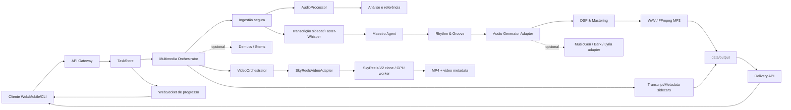

# Arquitetura do KAIR-S-SONICA

## Princípio de composição

O sistema é organizado como um **pipeline de portas e adaptadores**. O domínio musical conhece somente os contratos em `kairos_core`; detalhes de bibliotecas pesadas, binários externos ou serviços remotos ficam atrás de adaptadores substituíveis. Isso permite executar o projeto em CPU para desenvolvimento e mover os mesmos contratos para GPU, workers e armazenamento distribuído em uma etapa posterior.

## Componentes

| Componente | Entrada | Saída | Estado |
| --- | --- | --- | --- |
| `MaestroAgent` | `TrackRequest` | `TrackPlan` | Funcional e determinístico |
| `RhythmAgent` | BPM, swing, humanização | Grade temporal | Funcional |
| `ProceduralDemoGenerator` | Plano musical | Matriz PCM estéreo | Funcional, CPU |
| `AudioGenerator` | Plano musical | Matriz PCM | Contrato para modelos |
| `DSP` | PCM | PCM masterizado | Funcional, NumPy |
| `StemSeparator` | Arquivo de áudio | Mapa de stems | Contrato opcional |
| `AudioProcessor` | Arquivo multimídia | PCM + `AudioAnalysis` | WAV local; formatos extras via SoundFile/FFmpeg |
| `Transcriber` | Áudio + backend | `TranscriptResult` | Sidecar funcional; Faster-Whisper opcional |
| `MultimediaOrchestrator` | `MultimediaRequest` | Áudio + JSON + metadados | Funcional em MVP |
| `VideoOrchestrator` | `VideoRequest` | MP4 + JSON + metadados | Funcional com backend opcional |
| `SkyReelsVideoAdapter` | Contrato de vídeo + checkpoint | MP4 publicado | Isolado; requer GPU/checkpoint |
| `Transcoder` | PCM/WAV | WAV/MP3 | WAV funcional; MP3 via FFmpeg |
| `TaskStore` | Estado de pipeline | Snapshot e eventos | Em memória no MVP |
| API | JSON/WebSocket | JSON/arquivo | Funcional |

## Fluxo de uma geração

1. O gateway valida `TrackRequest` e atribui um identificador de tarefa.
2. O `MaestroAgent` normaliza gênero, tonalidade, escala, BPM e seções.
3. O orquestrador cria a grade de groove, chama o gerador configurado e aplica masterização conservadora.
4. O transcodificador grava WAV e, quando solicitado e disponível, chama FFmpeg para MP3 CBR de 320 kbps.
5. O `TaskStore` atualiza progresso; a API expõe polling e WebSocket para o cliente.

## Fluxo multimídia

A central multimídia segue o mesmo contrato de tarefa, mas adiciona ingestão, análise e transcrição antes da geração. `POST /v1/orchestrate` resolve referências apenas em diretórios permitidos, usa `AudioProcessor` para obter métricas técnicas, escolhe o backend de transcrição e converte o texto em contexto para o Maestro. O resultado publica áudio, transcrição e metadados como artefatos separados. O fluxo completo, os estados e os perfis de dependência estão em [`multimedia-architecture.md`](multimedia-architecture.md).

O fluxo audiovisual adiciona `POST /v1/video/generate`, que usa o mesmo `TaskStore`, polling e WebSocket, mas mantém o SkyReels em um clone independente. O adaptador aceita geração T2V/I2V, Diffusion Forcing, extensão e controle start/end; o contrato e os gates de operação estão em [`video-architecture.md`](video-architecture.md).

## Controle artístico KTD

No domínio de produto, **KTD — Kháirus the Dragon** é a persona artística humana e **Káiros** é o DJ-maestro que orquestra produção, carreira e pipeline. A continuidade visual é controlada por `docs/ktd-visual-bible.md`; a voz, o flow e o histórico de versões estão em `personas/artist-principal/voice-profile.md` e no manifesto JSON. A geração de áudio possui um gate de aprovação humana: uma saída instrumental ou uma tentativa tecnicamente válida não se torna referência oficial enquanto o artista não aprovar groove, voz, pocket, mixagem e integração.

## Segurança e licenciamento

A base não inclui pesos de modelos, credenciais, scraping de plataformas fechadas ou código proprietário. Cada integração de modelo deverá declarar licença, origem do checkpoint, formato de entrada, consumo de VRAM e política de uso de voz. O adaptador de voz deve exigir autorização explícita para qualquer identidade vocal; este repositório apenas reserva o contrato técnico.

## Escala futura

O `TaskStore` atual é intencionalmente simples. Para produção, substitua-o por uma implementação Redis/PostgreSQL e mova `AudioPipeline.run` para workers. O contrato de progresso permanece igual, permitindo adicionar Celery, Dramatiq, NATS ou outro broker sem alterar o cliente.
