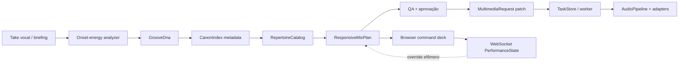

# StudioMaster — estúdio musical orquestrado por IA

## Objetivo

O StudioMaster amplia a Ilha de Produção Artística do DJ Káiros para um estúdio musical cooperativo entre agentes. A primeira fatia transforma um take vocal ou uma intenção musical em um mapa de groove revisável, cruza esse mapa com um cânone cultural editorial e seleciona um repertório instrumental com cadeia de mixagem declarativa. O sistema permanece **complementar** ao `AudioPipeline`, ao `MultimediaOrchestrator`, ao `TaskStore` e aos workers existentes.

> O StudioMaster planeja, mede e propõe. Ele não promete uma classificação neural quando o modelo não foi executado, não copia uma gravação de referência e não persiste áudio automaticamente.

## Equipe de agentes

Os 12 papéis do `AgenticOrchestrator` continuam sendo a equipe de coordenação audiovisual: CEO, CCO, Roteirista, DoP, Designer de Som, Editor, VFX, Social, Produtor, RAG, Acessibilidade e QA. O StudioMaster entra como uma ferramenta especializada do Designer de Som, com responsabilidades separadas entre análise, curadoria e execução.

| Papel | Responsabilidade no StudioMaster | Saída | Gate |
| --- | --- | --- | --- |
| Designer de Som | Define foco vocal, groove, repertório e cadeia | `ResponsiveMixPlan` | Aprovação musical |
| Groove/Flow analyzer | Mede onsets, densidade e microtiming | `GrooveDna` | Método/confiança declarados |
| Curador cultural | Escolhe correspondência editorial | entrada do `CanonIndex` | Procedência e revisão cultural |
| Arranjador | Seleciona componentes instrumentais | `RepertoireProfile` | asset próprio/licenciado |
| Mix Engineer | Propõe sidechain, width, delay e master bus | cadeia declarativa | Adapter DSP habilitado |
| Performance Controller | Recebe comandos do DJ em tempo real | `PerformanceState` | Sessão efêmera |
| QA | Verifica limites, licenças e handoff | warnings/gates | Aprovação explícita |

O time não é uma coleção de modelos que opera sem supervisão. Cada agente produz contratos que podem ser revisados, auditados e encaminhados ao pipeline somente depois dos gates existentes.

## Camadas



A implementação atual usa NumPy e PyYAML já presentes no core. `librosa`, `aubio`, PyTorch, torchaudio, Pedalboard, pyrubberband, FluidSynth, Demucs e modelos de pitch são adapters opcionais. O caminho de teste não baixa pesos, não instala plugins e não exige GPU.

## Cânone cultural

`config/canon_index.yaml` é um índice de metadados abstratos. Cada entrada possui ID, nome editorial, região, faixa de BPM, swing ratio, padrão descritivo, contexto cultural, origem do registro e nota de direitos. Não há samples, loops, MIDI, embeddings ou fingerprints.

A correspondência atual é uma heurística por proximidade entre BPM/swing e não deve ser apresentada como identificação de origem étnica ou classificação musicológica. A futura versão neural poderá propor probabilidades, mas deverá declarar dataset, licença, escopo, viés, calibração, versão do modelo e incerteza. O operador deve sempre poder substituir a sugestão.

Referências a gêneros, cenas ou produtores nos briefings são tratadas como atributos de produção de alto nível — andamento, densidade, microtiming, peso de subgrave, espaço vocal e estrutura — e não como instrução para copiar a assinatura de uma pessoa, faixa ou gravação específica.

## Repertório instrumental

`config/instrumentation_repertoire.yaml` mapeia funções musicais a engines declarativas. Perfis podem usar `synthesis` para o renderer leve ou `optional-synth`, `optional-sfz`, `optional-fluidsynth` e `audio_input` para adapters que o operador instala e configura fora do caminho obrigatório.

O campo `asset_ref` é deliberadamente nulo nos perfis versionados. Quando um projeto adicionar um asset, deve registrar licença, fonte, checksum, autorização de uso e escopo de distribuição em um catálogo externo ao código. O Git não recebe samples, soundfonts, presets comerciais ou stems privados.

As cadeias declarativas usam tipos como `eq`, `compressor`, `multiband_comp`, `sidechain_duck`, `harmonic_exciter`, `stereo_widener`, `delay_stack`, `convolution_reverb`, `soft_clip` e `limiter`. O `NumpyChainExecutor` da Ilha permanece um preview limitado; não é um substituto para uma masterização profissional.

## Análise de groove

`POST /v1/studio-master/groove/analyze` recebe amostras mono, sample rate, BPM e um `canon_id` opcional. O extrator:

1. valida forma, finitude e limite de 250.000 amostras;
2. suaviza uma envoltória de energia e encontra picos locais com distância mínima;
3. calcula densidade de onsets, offset médio e desvio de microtiming em relação a uma grade de 16 avos;
4. deriva um swing ratio limitado a 0,50–0,67;
5. escolhe o padrão canônico mais próximo e retorna probabilidades heurísticas por região;
6. inclui o método `deterministic-onset-energy/v1` e um aviso de que nenhum modelo neural foi executado.

A função `apply_flow_to_events` atua somente no contrato abstrato `RhythmEvent`. Ela desloca off-beats com base no mapa recebido e devolve novos eventos, sem modificar o array original ou um arquivo de áudio.

## Plano responsivo e handoff

`POST /v1/studio-master/responsive-plan` combina flow, cânone, repertório, BPM, swing, humanização, grid follow, foco vocal e punchline. A resposta `READY_FOR_APPROVAL` contém:

| Campo | Conteúdo |
| --- | --- |
| `canon` | Padrão selecionado e nota de procedência |
| `repertoire` | Componentes e cadeia de mixagem |
| `timing` | BPM, swing ratio, swing em ms, humanização e política de grade |
| `vocal_focus` | Sidechain, cadeia vocal e comportamento de punchline |
| `handoff` | Destino `POST /v1/orchestrate`, aprovação e patch de `MultimediaRequest` |
| `warnings` | Limitações, licença e necessidade de revisão |

O `AgenticToolbox.audio_handoff()` injeta esse plano no handoff `multimedia_request` do Sound Designer. O patch é compatível com o pipeline existente e contém BPM, swing, humanização, gênero e `stems=true`. A rota de submissão continua exigindo `approve_handoffs=true`; nenhum job nasce de um plano não aprovado.

## Performance em tempo real

O command deck do navegador abre `WS /ws/studio-master/{session_id}/performance`. O estado fica em memória e pode ser consultado por `GET /v1/studio-master/performance/{session_id}`. Os comandos são:

| Comando | Efeito |
| --- | --- |
| `SET_SWING` | Atualiza ratio entre 0,50 e 0,67; aceita `0.65` ou `65%` |
| `SET_GRID_FOLLOW` | Liga/desliga a perseguição da base ao flow |
| `SET_BPM` | Atualiza BPM entre 40 e 240 |
| `BOOST_PUNCHLINE` | Propõe +3 dB e redução de reverb de 3 dB |
| `RESET` | Restaura estado de sessão |
| `PUSH_TO_LIBRARY` | Cria proposta de metadados `PENDING_APPROVAL` |

`PUSH_TO_LIBRARY` não salva áudio, MIDI, samples ou presets. Uma futura aprovação terá de incluir origem, licença, autor, contexto, checksum e revisão editorial antes de publicar um novo item.

## Operação segura

O StudioMaster permanece habilitado para planejamento local, mas não habilita qualquer adapter externo. Os limites são controlados por:

```bash
KAIROS_STUDIO_MASTER_ENABLED=true
KAIROS_CANON_INDEX_PATH=config/canon_index.yaml
KAIROS_INSTRUMENTATION_REPERTOIRE_PATH=config/instrumentation_repertoire.yaml
KAIROS_STUDIO_MASTER_MAX_INPUT_SAMPLES=250000
```

O gateway mantém os defaults dos agentes externos, SkyReels, downloads de modelo e provedores de mídia. Segredos continuam exclusivamente em variáveis de ambiente. A publicação final de áudio permanece dependente dos gates do pipeline, do sidecar de metadados e das validações de artefato já existentes.

## Roadmap de adapters

A evolução recomendada é incremental. Primeiro, adicionar LUFS integrado, true peak e análise de loudness ao executor; depois, criar adapters isolados para Pedalboard/SciPy, FluidSynth, Demucs e pitch tracking; por fim, adicionar upload autenticado de stems, persistência de sessões, timeline com trim/crossfade e handoff de stems aprovados. Cada adapter deve ter capability própria, teste sem dependência instalada, teste de integração opcional, política de licença e nenhum download implícito.

## StudioMaster 2.0 em operação

A segunda camada amplia o command deck com proposta de arranjo macro, expressividade de notas abstratas, sketch de pitch, Modo Káiros, clip social, analytics e controle de elegibilidade para auto-retraining. Cada ação retorna um contrato revisável e permanece separada do `TaskStore` até uma decisão explícita.

> O princípio operacional é: **a IA propõe; o operador aprova; o pipeline existente executa; a validação confirma; a promoção publica de forma atômica**.

O auto-retraining foi implementado como um guard de manifesto, não como treinamento embutido. Para tornar uma proposta elegível, o manifesto precisa declarar samples aprovados, aprovação do operador, proveniência/licença e split de validação. Mesmo com `READY_FOR_APPROVAL`, o sistema não baixa dados, importa Torch, grava checkpoint ou altera o modelo em produção. O comando `scripts/auto_retrain.py` apenas imprime o plano em JSON e pode ser inspecionado por cron em um host de treinamento autorizado.

O histórico de produção utiliza JSON local append-only e escrita atômica. A rota de registro rejeita entradas sem `approved=true`, e o payload contém somente metadados como `task_id`, gênero, BPM, score técnico/MOS opcional e `master_asset_id`. Áudio, embeddings, loops, samples e presets proprietários não entram no histórico base.

O plano de clip social suporta canvas vertical, quadrado ou paisagem, waveform RMS e adapter `moviepy-or-browser-canvas`. Ele não publica em redes sociais, não baixa fontes ou áudio e não cria MP4 sem uma futura etapa explícita de renderização aprovada. A validação visual local confirmou estados de arranjo, Modo Káiros e clip, além de `0 produções · MOS pendente`, `auto-retraining desligado` e `0/8 adapters detectados` no ambiente leve.

### Próxima evolução recomendada

A próxima branch deve implementar adapters opcionais de renderização real, pitch tracking e DSP profissional em host dedicado, sempre por interfaces de capacidade. Cada adapter deverá declarar versão, licença, checksum, custo computacional, requisito de GPU/CPU, política de armazenamento e testes de fallback. A promoção de qualquer artefato deve continuar condicionada à validação técnica, consentimento de uso e troca atômica.
