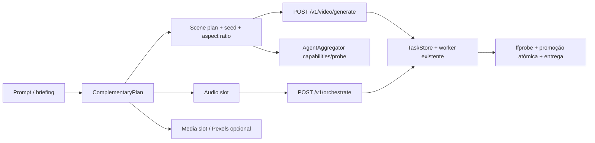
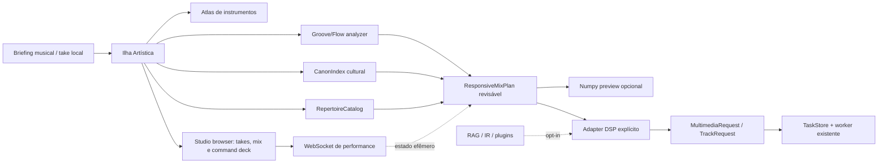

# Núcleo audiovisual generativo — KAIR + SkyReels-V2

## Objetivo

Este documento define a integração não destrutiva do **KAIR-S-SONICA** com o clone independente do **SkyReels-V2**. O KAIR continua sendo o orquestrador de tarefas, contratos, progresso, armazenamento e auditoria; o SkyReels permanece um backend externo, isolado por processo, dependências, checkpoint e licença.

> **Regra operacional:** o núcleo não declara que um vídeo foi gerado por modelo neural quando o backend está desabilitado, o checkpoint não está disponível ou a execução não produziu um MP4 verificável.

A integração cobre os caminhos T2V, I2V, Diffusion Forcing para vídeos longos, extensão de vídeo e controle de frame inicial/final. O backend pode ser selecionado por requisição com `backend=cli` (entry points versionados do clone) ou `backend=native` (pipelines Python nativas do Diffusers). Nenhum módulo ou peso é copiado para dentro do pacote principal do KAIR.

## Arquitetura

```mermaid
flowchart LR
  C[Cliente / Web / CLI] --> G[POST /v1/video/generate]
  G --> T[TaskStore SQLite\nPENDING/RUNNING/SUCCEEDED/FAILED]
  T --> W[Worker persistente / GPU]
  W --> V[VideoOrchestrator]
  V --> A[SkyReelsVideoAdapter]
  A --> I[Ingestão segura\ndata/uploads ou data/output]
  A --> S[Staging isolado\ndata/output/.skyreels/{task_id}]
  S --> R[Clone independente\nSkyReels-V2 CLI]
  R --> M[Checkpoint local\nsem pesos no Git]
  R --> P[MP4]
  P --> O[data/output/{task_id}.mp4]
  O --> D[GET /v1/video/{task_id}]
  O --> J[{task_id}.metadata.json]
  T --> E[WS /ws/tasks/{task_id}]
```

O modo `inline` mantém o desenvolvimento local simples. No perfil de produção, `KAIROS_WORKER_MODE=queue` faz a API apenas persistir o payload em SQLite e responder `202`; o processo `scripts/run_worker.py` reivindica jobs com atualização condicional, executa fora do request e remove o job apenas em estado terminal. Jobs `PENDING`/`RUNNING` são devolvidos à fila após reinício, de modo que a geração não desapareça quando o processo da API ou do worker é reiniciado.

A saída é copiada do staging para um nome determinístico por tarefa somente depois de localizar um MP4 não vazio e validá-lo com `ffprobe`. Caso o destino já exista, a promoção falha em vez de sobrescrever o artefato. O staging é removido ao final por padrão e pode ser retido apenas com `KAIROS_SKYREELS_KEEP_STAGING=true` para diagnóstico.

## Núcleo complementar de desenvolvimento audiovisual

A arquitetura anexada de ecossistema audiovisual foi incorporada como uma camada de **planejamento e handoff**, não como uma aplicação concorrente. Ela organiza prompt, duração, cenas, slots de mídia stock, slots de áudio e templates de requisição; a execução continua nos contratos que já existem no KAIR-S-SONICA.



A rota `GET /v1/complementary/capabilities` descreve a camada sem rede. `POST /v1/complementary/plan` é síncrona, determinística e não cria tarefa, não baixa mídia, não gera áudio e não dispara agentes. O consumidor revisa o retorno e decide se encaminha cada cena ao `POST /v1/video/generate`, áudio ao `POST /v1/orchestrate` ou storyboard ao agente apropriado. Assim, a estrutura proposta no anexo — `generator`, `audio`, `media_fetcher` e `app` — é representada por contratos e adaptadores complementares, sem reintroduzir uma segunda API Flask, uma segunda fila ou uma segunda política de armazenamento.

| Conceito da arquitetura complementar | Implementação aditiva no KAIR | Estado |
| --- | --- | --- |
| `app.py` | Rotas FastAPI `/v1/complementary/*` | Planejamento síncrono; gateway original preservado |
| `generator.py` | `video_request_template` por cena | Handoff para o SkyReels/worker existente |
| `audio.py` | `audio` slot com handoff para `/v1/orchestrate` | Nenhum TTS automático |
| `media_fetcher.py` | `media` slot e capability Pexels | Desabilitado; nenhuma chave necessária no teste |
| `outputs/` | `KAIROS_OUTPUT_DIR` e promoção atômica existentes | Sem nova pasta ou sobrescrita |
| `requirements.txt` | Dependências já instaladas do núcleo | Sem MoviePy/gTTS obrigatórios no caminho principal |

## Orquestração agentica end-to-end

Os anexos foram materializados como `kairos_core.agentic`, uma camada contract-first sobre o núcleo complementar. O `AgenticOrchestrator` coordena 12 papéis — CEO, CCO, Roteirista, DoP, Designer de Som, Editor, VFX, Social, Produtor, RAG, Acessibilidade e QA — em uma sequência determinística de mensagens JSON. Isso oferece uma implementação executável e testável sem tornar AutoGen, LangChain, ChromaDB ou um LLM dependência obrigatória do caminho principal.

```mermaid
flowchart LR
  B[Briefing] --> A[AgenticOrchestrator]
  A --> C[CEO + CCO]
  C --> R[Roteirista + RAG]
  R --> D[DoP + Sound Designer]
  D --> E[Editor + VFX]
  E --> S[Social + Acessibilidade]
  S --> Q[QA + aprovação CEO]
  Q --> H[Handoffs VideoRequest / MultimediaRequest]
  H --> T[TaskStore existente]
  T --> W[Worker inline ou queue]
  W --> K[SkyReels / áudio / ffprobe / entrega]
```



`GET /v1/agentic/capabilities` expõe os papéis e contratos. `POST /v1/agentic/run` produz um pacote `READY_FOR_APPROVAL` por padrão, incluindo memória de projeto, referências, cenas, planos e handoffs. O campo `submit_handoffs` só cria tarefas quando também há `approve_handoffs=true`; nesse caso cada cena é enfileirada como `video` e o áudio como `multimedia`, reutilizando os runners e o modo `KAIROS_WORKER_MODE` existentes.

A memória inicial é JSONL por projeto em `KAIROS_AGENTIC_MEMORY_DIR`, com janela recente e busca lexical substituíveis por um backend vetorial futuro. O RAG usa a cadeia Pexels/Unsplash apenas quando `KAIROS_AGENTIC_EXTERNAL_TOOLS_ENABLED=true`; nenhum download é automático. O QA mantém gates de aprovação, `ffprobe`, artefato não vazio, ausência de watermark/texto acidental e promoção atômica.

## Ilha de Produção Artística e StudioMaster

A Ilha de Produção Artística do DJ Káiros é uma camada complementar ao estúdio de gravação/mixagem e ao orquestrador agentico. O Atlas `config/instrument_atlas.yaml` mantém perfis iniciais de instrumentos; o `SkillGenerator` transforma um perfil e um contexto em uma cadeia de 5–15 etapas; e o `NumpyChainExecutor` oferece um preview determinístico limitado para arrays mono/estéreo. Nenhuma dessas etapas substitui `MultimediaOrchestrator`, `AudioPipeline`, `TaskStore` ou os adapters SkyReels.



A Ilha expõe `GET /v1/artistic-island/capabilities`, `GET /v1/artistic-island/instruments` e `POST /v1/artistic-island/mix-plan`. O StudioMaster acrescenta `GET /v1/studio-master/capabilities`, `GET /v1/studio-master/canon`, `GET /v1/studio-master/repertoire`, `POST /v1/studio-master/groove/analyze`, `POST /v1/studio-master/responsive-plan`, snapshot HTTP de performance e `WS /ws/studio-master/{session_id}/performance`. Os endpoints são `plan-first`: não carregam plugins, não baixam bibliotecas, não consultam provedores externos, não criam tarefas e não afirmam que o resultado é um master final.

O analisador atual usa energia de onsets em CPU e retorna `GrooveDna` com método, confiança e avisos; ele não é uma rede neural. A aplicação inversa altera apenas eventos abstratos de ritmo e não edita áudio destrutivamente. O handoff agentico inclui o patch de BPM, swing, humanização, gênero e stems para o `MultimediaRequest`, mas continua sujeito a aprovação. A execução DSP profissional, separação de stems, FluidSynth, VST3/AU/LV2, medição LUFS/true peak e RAG de referências devem ser adapters com capability e aprovação próprios.

O Atlas inicial permanece separado do cânone cultural e do repertório instrumental. O cânone contém metadados abstratos de padrões, faixas de BPM, swing, região editorial e notas de direitos; o repertório contém perfis de componentes e cadeias de mixagem sem samples, MIDI, embeddings, loops ou presets proprietários. Expansões devem ocorrer por commits de dados separados, com licença, origem e checksum quando aplicável.

## Teste local com Docker Compose

O arquivo `docker-compose.agents.local.yml` cria um ambiente isolado com o gateway, um mock do SkyReels Space e um mock do LlamaGen. O mock não acessa a internet, não contém credenciais reais e implementa apenas os endpoints necessários para descoberta/probe. O script `scripts/test_agents_compose.sh` sobe o stack, valida `/v1/complementary/capabilities`, `/v1/agents/capabilities`, os dois probes e `/v1/complementary/plan`, e desmonta os containers ao final.

```bash
./scripts/test_agents_compose.sh
```

Esse Compose é exclusivamente de desenvolvimento. O `docker-compose.gpu.yml` continua sendo o perfil de produção e não recebe dependência dos mocks. O teste de Compose não prova inferência CUDA, download de checkpoint ou disponibilidade de terceiros; ele prova conectividade, contratos, gates e handoffs em uma rede local controlada.

## Observabilidade, cache e provedores opcionais

`kairos_core.observability` fornece `JsonFormatter`, `configure_logging` e `log_event` para eventos estruturados. A redaction remove chaves, tokens, senhas e cabeçalhos de autorização dos campos estruturados; o nível é controlado por `KAIROS_LOG_LEVEL`. A adoção é incremental: serviços existentes podem migrar handler por handler sem alterar contratos HTTP.

`MediaCache` grava em `KAIROS_MEDIA_CACHE_DIR`, calcula a chave com SHA-256, limita o tamanho por `KAIROS_MEDIA_CACHE_MAX_BYTES` e promove o arquivo temporário com `replace`, evitando consumidores observarem conteúdo parcial. `MediaProviderChain` usa `KAIROS_MEDIA_PROVIDER_ORDER` para tentar Pexels e depois Unsplash. Os provedores não são chamados quando suas variáveis de chave estão ausentes; o planner continua apenas com slots até que um operador faça um handoff explícito.

O CI existente continua sendo a única pipeline: passou a incluir branches `feat/**`/`sync/**`, compilar `tools/` e validar os três manifestos Compose. Não foi criado um workflow paralelo, nem foram removidos jobs de lint, teste ou build web.

## Agregador de agentes externos

O agregador de agentes é uma camada de descoberta e adaptação, não um bypass da fila ou dos gates editoriais. `AgentAggregator` retorna um catálogo local de capabilities para `skyreels-native`, `skyreels-space` e `llamagen`, incluindo skills, algoritmos, operações, origem e prontidão. O catálogo é determinístico e não consulta a rede; por isso pode ser usado pelo frontend e por ferramentas de planejamento sem disparar geração, upload ou custo externo.

| Agente | Papel | Ativação | Operações externas | Regra de segurança |
| --- | --- | --- | --- | --- |
| `skyreels-native` | Inferência local GPU via Diffusers | `KAIROS_ENABLE_SKYREELS=true` e `KAIROS_SKYREELS_NATIVE_API=true` | Nenhuma; usa o worker local | Checkpoint montado, CUDA e `ffprobe` obrigatórios |
| `skyreels-space` | Fallback remoto Gradio para SkyReels-V2 | agregador e agente Space habilitados | `/config`, `/gradio_api/info`, upload e chamada SSE | Probe e geração somente por ação explícita; schema remoto pode mudar |
| `llamagen` | Storyboards, quadrinhos e referências de personagens/locações | agregador e LlamaGen habilitados + `LLAMAGEN_API_KEY` | upload, criação, consulta e atualização REST | Bearer somente via ambiente; catálogo nunca gera automaticamente |

Os probes ficam em `GET /v1/agents/{agent_name}/probe` e só executam após a habilitação explícita. O probe do Space consulta o schema Gradio; o do LlamaGen usa uma leitura mínima de geração inexistente para classificar alcançabilidade e autorização. Respostas `502` representam indisponibilidade ou rejeição do terceiro; `503` representa integração desabilitada ou agente desconhecido. Nenhuma chave, token, peso ou resposta de geração é versionada.

| Camada | Implementação | Responsabilidade |
| --- | --- | --- |
| Contrato | `VideoRequest` | Validar modo, engine, resolução, frames, FPS, seed e referências |
| Orquestração | `VideoOrchestrator` | Padronizar intake e progresso do ecossistema KAIR |
| Adaptador CLI | `SkyReelsVideoAdapter` | Resolver paths, montar CLI, executar subprocesso e promover o MP4 |
| Adaptador nativo | `SkyReelsNativeAdapter` | Carregar pipeline Diffusers lazy, inferir em CUDA e exportar MP4 |
| Backend | `SkyReels-V2/generate_video.py` | T2V/I2V convencional |
| Backend | `SkyReels-V2/generate_video_df.py` | Diffusion Forcing, vídeo longo, extensão e start/end frame |
| Estado | `TaskStore` | Persistir status, resultado e payload de jobs sem expor caminhos internos |
| Execução | `scripts/run_worker.py` | Reivindicar jobs SQLite, recuperar reinícios e executar runners |
| Entrega | `/v1/video/{task_id}` | Servir apenas o artefato publicado para a tarefa concluída |
| Auditoria | `{task_id}.metadata.json` | Registrar modo, modelo, seed, comando, logs finais e staging |

## Modos suportados

| `mode` | `engine` | `backend` | Entrada exigida | Uso canônico |
| --- | --- | --- | --- | --- |
| `t2v` | `standard` ou `diffusion_forcing` | `cli` ou `native` | Prompt | Primeiro plano gerativo a partir de texto |
| `i2v` | `standard` ou `diffusion_forcing` | `cli` ou `native` | `image_path` | Animar keyframe aprovado |
| `extend` | `diffusion_forcing` | `cli` ou `native` | `video_path` | Continuar um plano preservando histórico temporal |
| `start_end` | `diffusion_forcing` | `cli` ou `native` | `image_path` e `end_image_path` | Controlar a abertura e o fechamento do plano |

A resolução `540P` usa como default 97 frames e `720P` usa 121 frames, conforme a convenção do entry point do SkyReels. Para geração longa, `num_frames` pode ser maior que `base_num_frames`; nesse caso, o adaptador aplica `overlap_history=17` quando o operador não informa outro valor.

## Mapeamento algorítmico

| Recurso do SkyReels-V2 | Parâmetros KAIR | Decisão de integração |
| --- | --- | --- |
| Diffusion Forcing | `engine=diffusion_forcing`, `ar_step`, `base_num_frames`, `overlap_history`, `addnoise_condition` | Caminho padrão para planos longos e continuidade temporal |
| Synchronous sampling | `ar_step=0` | Mais simples para planos curtos e testes de referência |
| Asynchronous/autoregressive sampling | `ar_step>0`, `causal_block_size>1` | Exige configuração explícita para evitar blocos incompatíveis |
| Text-to-video | `mode=t2v` sem imagem | Requer checkpoint T2V compatível |
| Image-to-video | `mode=i2v`, `image_path` | Requer keyframe em diretório permitido e checkpoint I2V compatível |
| Start/end frame control | `mode=start_end`, `image_path`, `end_image_path` | Mantém o fechamento do plano sob controle declarativo |
| Video extension | `mode=extend`, `video_path` | Preserva o prefixo como referência temporal do novo trecho |
| Prompt enhancer | `prompt_enhancer=true` | Permitido apenas para T2V, seguindo a restrição do CLI oficial |
| TeaCache | `teacache`, `teacache_thresh`, `use_ret_steps` | Otimização opcional; qualidade deve ser revisada humanamente |
| Offload | `offload=true` | Default para reduzir pressão de VRAM |
| Multi-GPU USP | `use_usp=true`, `seed` obrigatório | Só habilitar com ambiente distribuído validado |

O Diffusion Forcing trabalha com níveis de ruído variáveis por token e usa tokens mais limpos como contexto para recuperar tokens mais ruidosos; o mecanismo permite estender a sequência a partir do histórico final do trecho anterior [1]. O adaptador não reimplementa esse algoritmo: ele preserva o código oficial em seu clone e expõe seus parâmetros de forma tipada.

## Contrato HTTP

### Enfileirar uma geração

```http
POST /v1/video/generate
Content-Type: application/json
```

```json
{
  "prompt": "Cinematic live-action editorial rap music video, continuous rain, moving camera, no text, no watermark.",
  "mode": "i2v",
  "engine": "diffusion_forcing",
  "resolution": "540P",
  "image_path": "ktd-fire-in-the-flood-s01-approved-portrait-keyframe.png",
  "num_frames": 97,
  "fps": 24,
  "inference_steps": 30,
  "guidance_scale": 6.0,
  "shift": 8.0,
  "seed": 42,
  "offload": true
}
```

A resposta é `202 Accepted` com `task_id`. O estado é consultado em `GET /v1/tasks/{task_id}` ou acompanhado em `WS /ws/tasks/{task_id}`. Ao concluir, `artifact_url` aponta para `/v1/video/{task_id}` e `result.video` contém o resumo da execução. A documentação interativa fica disponível no `/docs` do gateway.

### Convenções de paths

Referências visuais e vídeos de entrada só podem estar em `KAIROS_UPLOAD_DIR` ou `KAIROS_OUTPUT_DIR`, após resolução canônica do caminho. O endpoint não aceita leitura arbitrária do host, e os pesos do modelo não são aceitos como upload da API. O operador deve montar o checkpoint em um caminho local conhecido no ambiente de inferência.

## Configuração segura

O backend está **desativado por padrão**. Para habilitá-lo, o ambiente precisa declarar explicitamente o clone, o checkpoint e a permissão operacional. O exemplo versionado em `.env.example` usa caminhos ilustrativos e não contém pesos nem credenciais.

| Variável | Default | Observação |
| --- | --- | --- |
| `KAIROS_ENABLE_SKYREELS` | `false` | Gate explícito do backend |
| `KAIROS_SKYREELS_REPO` | vazio | Caminho do clone independente |
| `KAIROS_SKYREELS_MODEL_ID` | vazio | Caminho local do checkpoint ou id remoto autorizado |
| `KAIROS_SKYREELS_PYTHON` | `python3` | Interpretador do ambiente SkyReels |
| `KAIROS_SKYREELS_ALLOW_MODEL_DOWNLOAD` | `false` | Bloqueia download implícito por padrão |
| `KAIROS_SKYREELS_TIMEOUT_SECONDS` | `3600` | Limite de uma execução do worker |
| `KAIROS_SKYREELS_MAX_CONCURRENCY` | `1` | Limite de inferências simultâneas por clone/modelo para evitar OOM |
| `KAIROS_SKYREELS_KEEP_STAGING` | `false` | Mantém staging apenas para diagnóstico explícito |
| `KAIROS_FFPROBE_BIN` | `ffprobe` | Validação estrutural do MP4 antes da publicação |
| `KAIROS_CORS_ORIGINS` | `http://localhost:8080` | Origens explícitas autorizadas para o frontend |
| `KAIROS_WORKER_MODE` | `inline` | Use `queue` com o worker persistente em produção |
| `KAIROS_LOG_LEVEL` | `INFO` | Nível do logging JSON estruturado |
| `KAIROS_MEDIA_CACHE_DIR` | `data/media-cache` | Cache de mídia opcional, fora do Git |
| `KAIROS_MEDIA_CACHE_MAX_BYTES` | `104857600` | Limite máximo de cada download/cache |
| `KAIROS_MEDIA_PROVIDER_ORDER` | `pexels,unsplash` | Ordem da cadeia de provedores opcionais |
| `KAIROS_AGENTIC_CORE_ENABLED` | `true` | Habilita planejamento/handoffs dos 12 papéis |
| `KAIROS_AGENTIC_MEMORY_DIR` | `data/agentic-memory` | Memória JSONL por projeto, fora do Git |
| `KAIROS_AGENTIC_EXTERNAL_TOOLS_ENABLED` | `false` | Permite RAG externo somente por ação explícita |
| `KAIROS_SKYREELS_NATIVE_MODEL_ID` | vazio | Diretório local `*-Diffusers` para `backend=native` |
| `KAIROS_SKYREELS_NATIVE_API` | `false` | Gate explícito da API nativa |
| `KAIROS_SKYREELS_DEVICE` | `cuda` | Device do pipeline nativo |
| `KAIROS_SKYREELS_DTYPE` | `bfloat16` | `float16`, `bfloat16` ou `float32` |
| `KAIROS_SKYREELS_CACHE_DIR` | vazio | Cache local compartilhado de componentes |
| `KAIROS_COMPLEMENTARY_CORE_ENABLED` | `true` | Gate do planejamento/handoff complementar; não habilita serviços externos |
| `KAIROS_AGENT_AGGREGATOR_ENABLED` | `false` | Gate global do catálogo e dos probes externos |
| `KAIROS_SKYREELS_SPACE_ENABLED` | `false` | Habilita o cliente remoto Gradio após o gate global |
| `KAIROS_SKYREELS_SPACE_BASE_URL` | `https://fffiloni-skyreels-v2.hf.space` | Base URL documentada do Space; revisar antes de produção |
| `KAIROS_SKYREELS_SPACE_ENDPOINT` | `generate_diffusion_forced_video` | Endpoint Gradio descoberto em `agents.md`/`config` |
| `KAIROS_SKYREELS_SPACE_TIMEOUT_SECONDS` | `1800` | Limite de chamada/polling do Space |
| `KAIROS_LLAMAGEN_ENABLED` | `false` | Habilita o cliente REST após o gate global |
| `KAIROS_LLAMAGEN_BASE_URL` | `https://api.llamagen.ai` | Base URL do Comic API |
| `KAIROS_LLAMAGEN_API_KEY_ENV` | `LLAMAGEN_API_KEY` | Nome da variável que contém o Bearer token |
| `KAIROS_LLAMAGEN_TIMEOUT_SECONDS` | `60` | Timeout de chamadas REST do LlamaGen |

O repositório SkyReels informa requisitos de VRAM muito superiores ao perfil CPU do MVP do KAIR: a documentação reporta aproximadamente 14,7 GB para o modelo 1.3B em 540P e cerca de 51,2 GB para o 14B em 540P [2]. Portanto, o teste unitário deste núcleo é deliberadamente um dry-run do contrato e da segurança; a inferência real requer um ambiente CUDA compatível, dependências do clone e checkpoints autorizados.

## API nativa Diffusers

A API nativa requer os pipelines SkyReels-V2 integrados ao Diffusers a partir da versão `0.35.0`, release que registra a inclusão do suporte SkyReels-V2 [6]. Os IDs oficiais em formato Diffusers incluem `Skywork/SkyReels-V2-DF-1.3B-540P-Diffusers`, `Skywork/SkyReels-V2-DF-14B-540P-Diffusers`, `Skywork/SkyReels-V2-DF-14B-720P-Diffusers`, `Skywork/SkyReels-V2-T2V-14B-540P-Diffusers`, `Skywork/SkyReels-V2-T2V-14B-720P-Diffusers`, `Skywork/SkyReels-V2-I2V-1.3B-540P-Diffusers`, `Skywork/SkyReels-V2-I2V-14B-540P-Diffusers` e `Skywork/SkyReels-V2-I2V-14B-720P-Diffusers` [4] [5].

A chamada HTTP usa o mesmo endpoint, mas precisa declarar `"backend": "native"`. O adaptador escolhe `SkyReelsV2DiffusionForcingPipeline` para DF/T2V, `SkyReelsV2DiffusionForcingImageToVideoPipeline` para DF/I2V e start/end, `SkyReelsV2DiffusionForcingVideoToVideoPipeline` para extensão, `SkyReelsV2Pipeline` para T2V standard e `SkyReelsV2ImageToVideoPipeline` para I2V standard. Os pipelines são carregados sob demanda, permanecem em cache por modelo/modo/device/dtype e são protegidos pelo mesmo limite de concorrência GPU.

O provisionamento é deliberadamente explícito e idempotente:

```bash
python3 scripts/provision_skyreels.py \\
  --repo /opt/models/SkyReels-V2 \\
  --models-root /models \\
  --native-model-id Skywork/SkyReels-V2-DF-1.3B-540P-Diffusers \\
  --revision <commit-ou-tag-auditado> \\
  --download
```

Sem `--download`, o script somente valida o clone e o layout local. Com `--download`, o operador autoriza o acesso ao Hub; o token opcional é lido de `HF_TOKEN`, nunca impresso nem gravado. O destino exige `model_index.json`, `vae/config.json` e `transformer/config.json`, grava `kairos-skyreels-manifest.json` e usa lock de processo para evitar downloads concorrentes. O compose GPU aponta `KAIROS_SKYREELS_NATIVE_MODEL_ID` para esse diretório e mantém `KAIROS_SKYREELS_ALLOW_MODEL_DOWNLOAD=false` durante a inferência.

## Integração com cenas canônicas

A fila existente de `Fire in the Flood` continua sendo a autoridade editorial para duração, keyframes, prompts e gates. Esta integração não altera seu status `blocked_audio_alignment`, não promove cenas automaticamente e não substitui a revisão humana. Cada item de fila pode ser convertido em um `VideoRequest` quando o gate de áudio, direitos, identidade visual e aprovação artística estiver liberado.

Para uma obra de múltiplos planos, o fluxo recomendado é gerar cada cena em uma tarefa própria, usar o keyframe aprovado quando disponível, preservar o `seed` e registrar o `task_id` produzido no relatório de produção. A montagem, normalização de 720×1280 a 24 fps e mux com a master permanecem responsabilidades do assembly downstream já existente; a geração neural não deve apagar ou reescrever masters históricos.

## Direitos, segurança e operação

A licença do SkyReels exige observância da **Skywork Community License** e inclui restrições de uso e responsabilidade que devem ser revisadas antes de distribuição comercial [3]. O KAIR registra o backend e o modelo no sidecar, mas não substitui a avaliação jurídica, a revisão de procedência dos dados ou a aprovação do titular da identidade visual e vocal.

O perfil de produção usa `docker-compose.yml` combinado com `docker-compose.gpu.yml`. O segundo arquivo constrói `Dockerfile.gpu`, monta o clone em `/opt/SkyReels-V2`, monta os checkpoints em `/models`, habilita `KAIROS_ENABLE_SKYREELS=true`, força `KAIROS_WORKER_MODE=queue`, limita a concorrência e inicia o worker persistente com os mesmos volumes da API. O endpoint `/health` serve ao liveness; `/ready` só retorna sucesso quando clone, entry point e checkpoint configurado estão disponíveis.

Para agentes externos, o procedimento é: manter os três gates desativados; consultar `GET /v1/agents/capabilities`; revisar procedência, licença, limites, retenção e custo; definir as variáveis sem colocar segredos em `.env.example` ou Git; habilitar primeiro o agente desejado; executar o probe; e só então integrar uma geração deliberada ao fluxo de produção. A chave do LlamaGen deve ser fornecida por secret manager/ambiente como `LLAMAGEN_API_KEY`; a chave testada durante esta sincronização retornou HTTP 403 e não deve ser considerada válida.

Antes de exposição em internet, a documentação do KAIR ainda recomenda autenticação no gateway, limites de tamanho, validação MIME, checksum, expiração de artefatos, métricas, logs estruturados e isolamento adicional de workers. Essas proteções são complementares ao worker persistente implementado nesta etapa e devem ser fornecidas pelo ingress/reverse proxy antes de abrir o serviço publicamente.

## Referências

[1]: https://arxiv.org/abs/2504.13074 "SkyReels-V2 technical report"
[2]: https://github.com/SkyworkAI/SkyReels-V2#quickstart "SkyReels-V2 Quickstart and model requirements"
[3]: https://github.com/SkyworkAI/Skywork/blob/main/Skywork%20Community%20License.pdf "Skywork Community License"
[4]: https://huggingface.co/docs/diffusers/en/api/pipelines/skyreels_v2 "Diffusers SkyReels-V2 native pipeline API"
[5]: https://huggingface.co/Skywork/SkyReels-V2-DF-1.3B-540P "Official SkyReels-V2 DF 1.3B checkpoint"
[6]: https://github.com/huggingface/diffusers/releases/tag/v0.35.0 "Diffusers v0.35.0 release notes"
